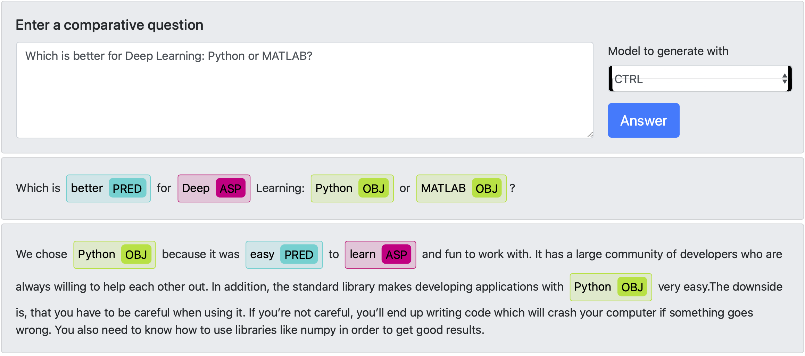

# Comparative Question Answering System (CoQAS)

This repository contains materials related to the following paper at the EACL-2021 conference at the demo track: 

> Chekalina, V., Bondarenko, A., Biemann, C., Beloucif, M., Logacheva, V., Panchenko, A. (2021): Which is Better for Deep Learning: Python or MATLAB? Answering Comparative Questions in Natural Language. In Proceedings of 16th conference of the European Chapter of the Association for Computational Linguistics (EACL). Kiev, Ukraine (online). 

A sample output of the system is presented below:

- To get an idea about how the system works  captured a [video demonstrating system capabilities](https://youtu.be/_DltlG-TMcc). 
- You can test the system: [online demo](https://nlp.zhores.net/coqas/). You can try answering questions like "What is better bread or pizza?" or "What is cheaper for travelling plain or bus?" using this system and get an answer in natural language. 
- To ensure reproducibility, we publicly release our code and data in this repository. 

The system allows a choice between three models (pre-selected from many more tested ones in the preliminary experiments). These methods rely on complementary mechanisms (extraction from text snippets, pre-trained language models or retrieval).  Below we provide examples of the outputs of all three readily available models for the question "What is better tea or coffee?".

**Snippets:**

"I did feel a bit more relaxed after drinking it too...I wonder if it was legitimate or just the product marketing? The taste is smooth and mellow with a slight hint of chocolate. It's heartier than regular tea and lighter (and better for your health) than coffee. Let the patient's taste decide. In general, the dry and dirty tongue always prefers tea to coffee, and will quite decline milk, unless with tea. Coffee is a better restorative than tea, but a greater impairer of the digestion."

**CAM**

"Tea is better than coffee. 

On the one hand: 
1) It's heartier than regular tea and lighter (and better for your health) than coffee. 
2) if tea is better tasting than coffee or if clean air is easier to . 
3) Also, Lutherans make better coffee than Methodists, but Southern Baptists make much worse coffee; stick to the iced tea. 

On the other hand: 
1) Coffee is a better restorative than tea, but a greater impairer of the digestion. 
2) Coffee is a better re- storative than tea, but a greater impairer of the diges- tion. 
3) Coffee is better than tea 9."

**CTRL**

The answer to this question depends on the type of tea. If you are looking for a cup that has some caffeine and flavor, then go with green teas. Green teas have caffeine, but they also contain antioxidants which help prevent cancer cells. They can be used as an alternative to coffee because it does not produce any stomach upset like coffee. However, if you want something more relaxing than coffee, try black tea, especially when drinking in the evening. Black tea contains natural flavors, such as cinnamon, nutmeg, ginger, cloves, etc.

# Technical information about the system

Main backend module: *backend_extr.py* (used functionality in *utils.py, my_functions.py, generation/generation.py*)

Main frontend module: *frontend/frontend_sender.py*

NLU part in *NLU/*

NLG part in *generation/*

If you have any question about the system write an issue or drop an email to [Victoriia](mailto:sayankotor1@gmail.com).
